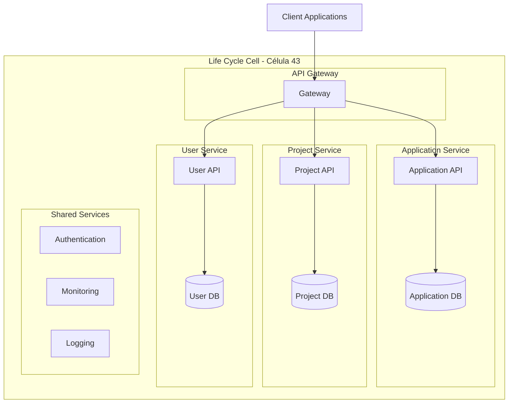
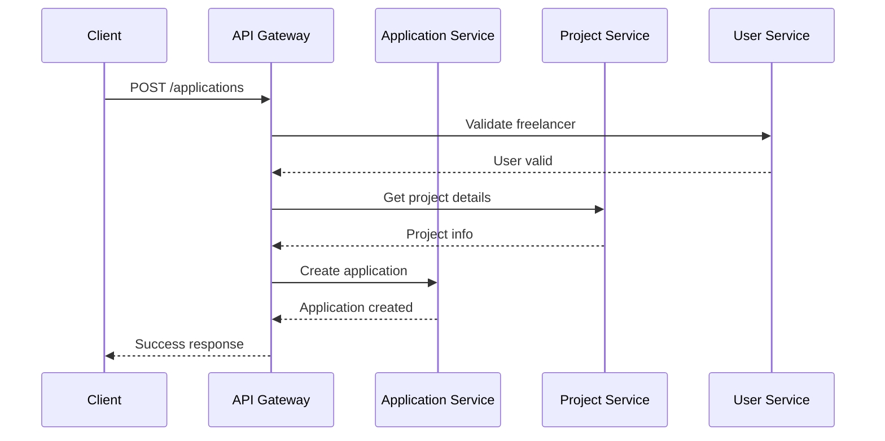
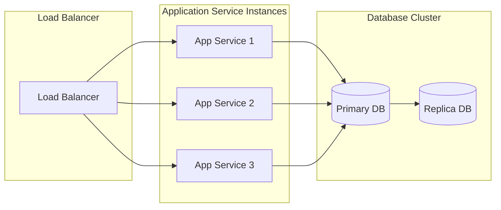

# Life Cycle Cell - Arquitectura de Células

## 🧬 Concepto de Arquitectura Orientada a Células

La **Arquitectura Orientada a Células** es un patrón de diseño que organiza sistemas complejos en unidades autónomas llamadas "células". Cada célula es independiente y contiene todos los componentes necesarios para cumplir una función específica del negocio.

### 🎯 Principios de las Células

1. **Autonomía:** Cada célula puede operar independientemente
2. **Especialización:** Cada célula tiene una responsabilidad específica
3. **Escalabilidad:** Las células pueden escalarse por separado
4. **Resiliencia:** El fallo de una célula no afecta otras
5. **Evolución:** Las células pueden evolucionar independientemente

## 🏗️ Arquitectura del Sistema

## 📋 Células Implementadas

### 🟢 Application Service (Activa)
- **Responsabilidad:** Gestión de postulaciones
- **Estado:** ✅ Implementada
- **Puerto:** 8080
- **Base de datos:** PostgreSQL (sql4)

### 🟡 Project Service (Planificada)
- **Responsabilidad:** Gestión de proyectos y empleadores
- **Estado:** 📋 Planificada
- **Puerto:** 8081

### 🟡 User Service (Planificada)
- **Responsabilidad:** Gestión de usuarios
- **Estado:** 📋 Planificada
- **Puerto:** 8082

### 🟡 API Gateway (Planificada)
- **Responsabilidad:** Enrutamiento y autenticación
- **Estado:** 📋 Planificada
- **Puerto:** 8000

## 🔄 Comunicación Entre Células

### Patrones de Comunicación

1. **Síncrona (REST)**
   - Para operaciones críticas
   - Respuesta inmediata requerida
   - Ejemplo: Validar usuario antes de crear postulación

2. **Asíncrona (Eventos)**
   - Para notificaciones
   - Operaciones no críticas
   - Ejemplo: Notificar cambio de estado de postulación

3. **Gateway Pattern**
   - Punto único de entrada
   - Enrutamiento centralizado
   - Autenticación centralizada

### Flujo de Datos

## 🗄️ Arquitectura de Datos

### Base de Datos por Célula

Cada célula mantiene su propia base de datos:

- **Application DB:** Tablas de postulaciones y estados
- **Project DB:** Tablas de proyectos y empleadores
- **User DB:** Tablas de usuarios y perfiles

### Ventajas de Separación de Datos

1. **Autonomía:** Cada célula controla sus datos
2. **Escalabilidad:** Bases de datos pueden escalarse independientemente
3. **Seguridad:** Aislamiento de datos sensibles
4. **Evolución:** Esquemas pueden cambiar sin afectar otras células

## 🚀 Despliegue y Escalabilidad

### Estrategia de Despliegue

1. **Desarrollo:** Servicios individuales en localhost
2. **Testing:** Docker Compose con todos los servicios
3. **Producción:** Kubernetes con auto-scaling

### Escalabilidad Horizontal

## 🔒 Seguridad

### Autenticación y Autorización

1. **JWT Tokens:** Para autenticación stateless
2. **Role-based Access:** Diferentes permisos por rol
3. **API Keys:** Para comunicación entre servicios
4. **Rate Limiting:** Protección contra abuso

### Aislamiento de Seguridad

- Cada célula tiene su propio contexto de seguridad
- Comunicación encriptada entre servicios
- Logs de auditoría por célula

## 📊 Monitoreo y Observabilidad

### Métricas por Célula

- **Performance:** Latencia, throughput, error rate
- **Business:** Métricas específicas del dominio
- **Infrastructure:** CPU, memoria, disco

### Logging Centralizado

- Logs estructurados en JSON
- Correlación de requests entre servicios
- Alertas automáticas por anomalías

## 🎯 Roadmap de Implementación

### Fase 1: Foundation (Actual)
- ✅ Application Service
- ✅ Docker Compose
- ✅ Base de datos PostgreSQL

### Fase 2: Core Services
- 📋 Project Service
- 📋 User Service
- 📋 API Gateway

### Fase 3: Advanced Features
- 📋 Authentication & Authorization
- 📋 Event-driven Communication
- 📋 Monitoring & Logging

### Fase 4: Production Ready
- 📋 Kubernetes Deployment
- 📋 CI/CD Pipeline
- 📋 Performance Optimization

## 🔧 Herramientas y Tecnologías

### Backend
- **Spring Boot 3.2.0**
- **Java 17**
- **Gradle**
- **PostgreSQL**

### DevOps
- **Docker & Docker Compose**
- **Kubernetes** (futuro)
- **GitHub Actions** (futuro)

### Monitoring
- **Spring Actuator**
- **Prometheus** (futuro)
- **Grafana** (futuro)

### Testing
- **JUnit 5**
- **TestContainers** (futuro)
- **Mockito**

Esta arquitectura proporciona una base sólida para construir un sistema escalable, mantenible y resiliente para la gestión de freelancers.
